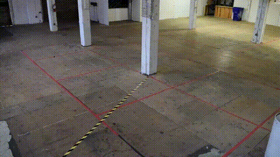

# AI_in_MM_LR_1 - Tracking object with color

В данной лабораторной работе создано простое приложение для трекинга объектов с использованием классических методов компьютерного зрения. В программе используются inRange(), threshold(), поиск центроида и рисование примитивов. При этом отрисовывается полный путь объекта на последовательности кадров.

Материалы работы:
- [Репозиторий с кодом Github](https://github.com/Eagle-008/AI_in_MM_LR_1).
- [Исходное видео на Яндекс.Диск](https://disk.yandex.ru/i/OENZkDXc9lQfzg)
- [Видео с результатом на Яндекс.Диск](https://disk.yandex.ru/i/SpxX4MlC5fOUqA)

|                        Превью видео                     |                     Разная частота маркеров             |
| :-----------------------------------------------------: | :-----------------------------------------------------: |
|      |    |
|  |  |||
